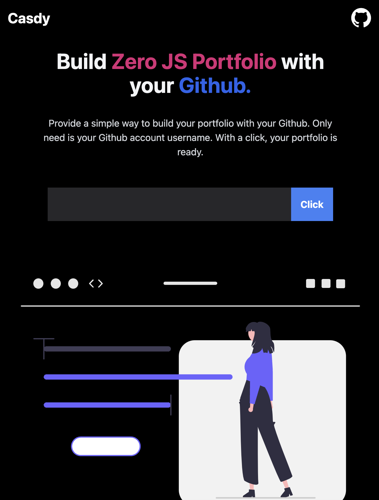
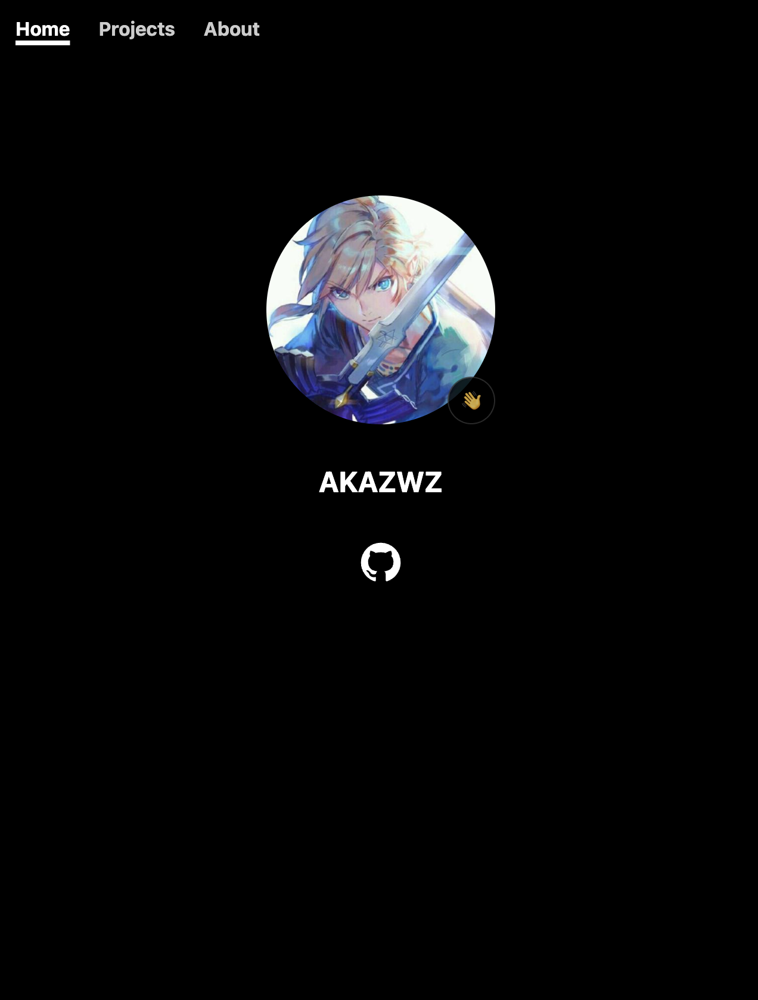
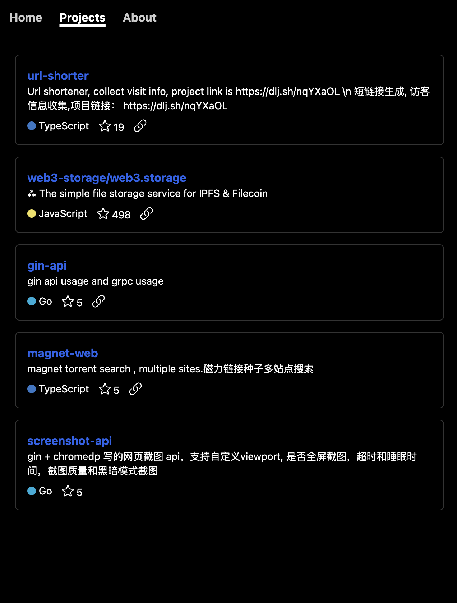
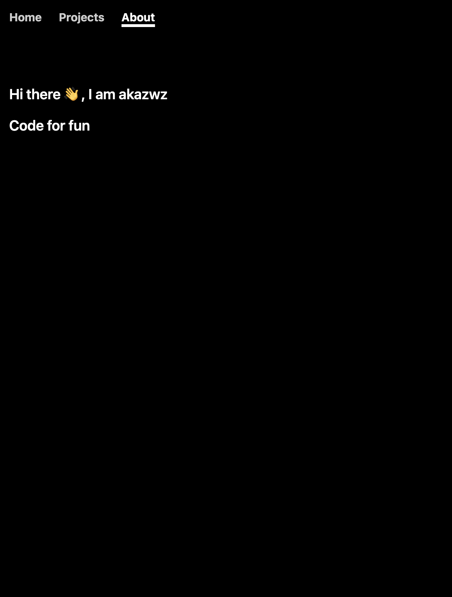

# Build Zero JS Portfolio use your Github

## Screenshots

1. Home

2. Portfolio

## How 
1. homepage is use  user info
2. projects is use  user pinned repos
3. about is use user same name repo README.md